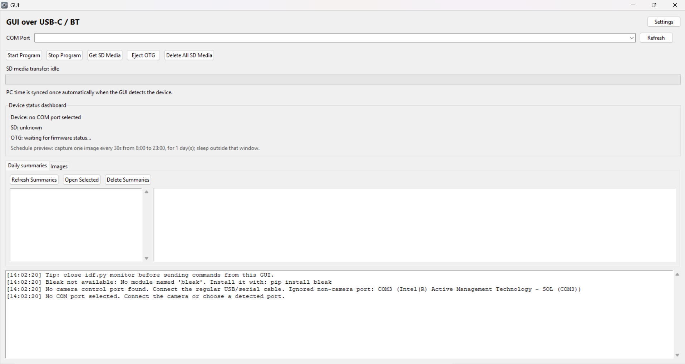
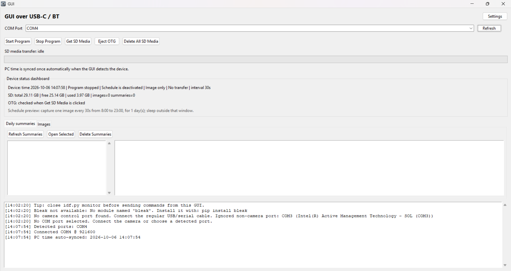
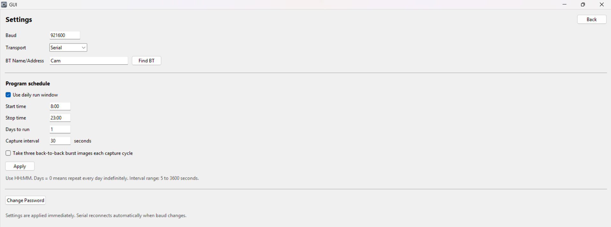

Shared Camera App
=================

This folder contains the single desktop application used by both sibling
firmware projects: Development Board Prototype and Breadboard Prototype. It will also be the single desktop application used by PCA once its delivered and up and running.

RUN
Double-click Launch_GUI.cmd or BreadboardCameraGUI.exe. Python and ESP-IDF
are not required for the packaged executable. Both firmware projects also
contain Launch_GUI.cmd shortcuts to this same application. On a fresh
installation without a password store, the initial password is ChangeMe123!.

Select the connected board's COM port or BLE connection inside the app. Click refresh, it will automatically detect the project with an ESP32-P4, no project selection is required.

Once project is detected, the Device status dashboard will show the device time, wether a programm is active or not, the schedule of the device, the capture interval. Next, the GUI shows the total free and used space on sd card, and how many images and summaries are already present. Below that teh GUI shows wether the device has an OTG cable attached, for rapid transfer of files.

When clicking on Settings, certain parameters can be configured, such as mode of transport, Bluetooth name, Program schedule, and wheveer the device should be in normal mode or burst mode. Clicking Apply will confirm teh schedule.

Password can also be changed. Password is needed to login and the transfer or deletion of imagesa and summaries.
