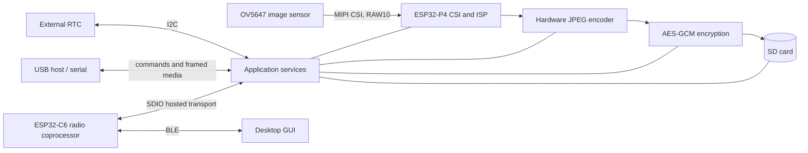
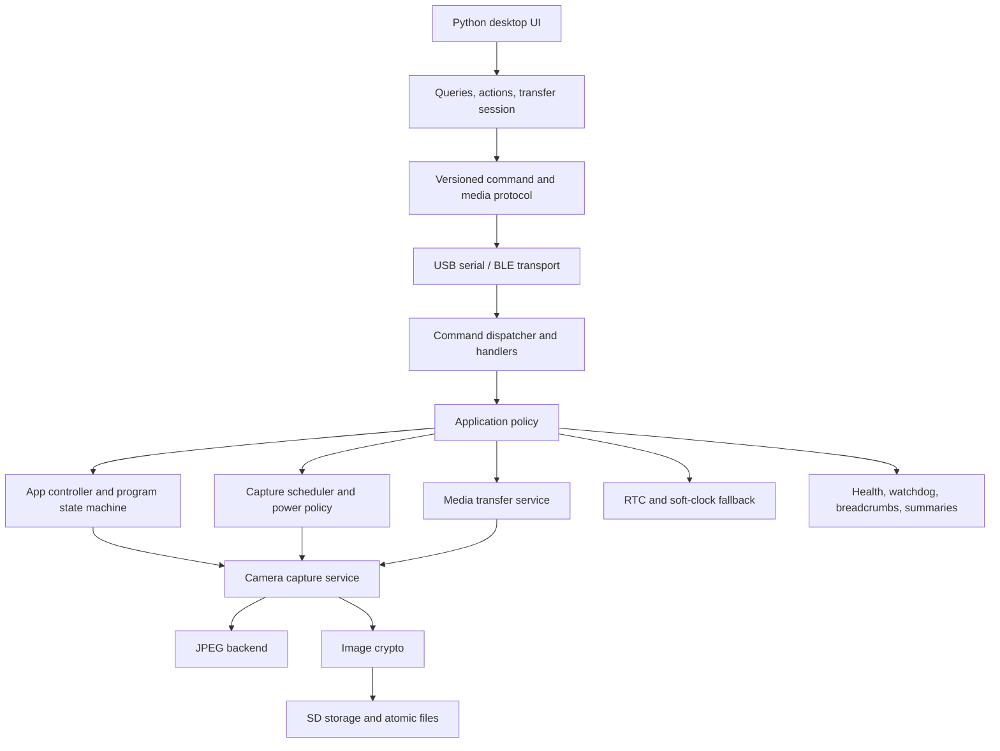
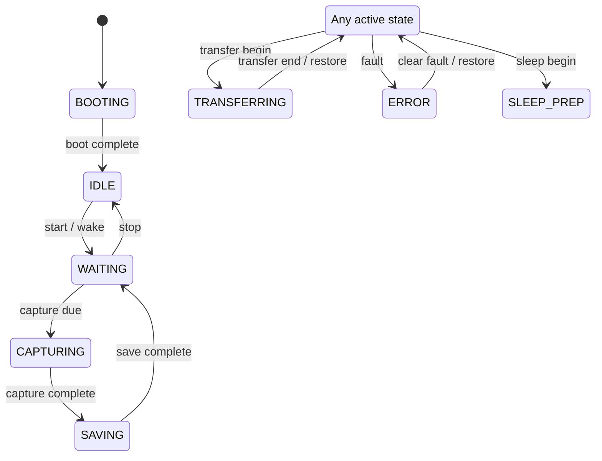

# Embedded Software Architecture of the Autonomous Camera Prototype

## 1. Introduction

An embedded camera is not simply a camera driver connected to a file-writing routine. It is a real-time system in which sensing, image processing, persistent storage, communications, scheduling, power management, security, and fault recovery all compete for limited processing time and memory. The software in this prototype addresses those concerns on an ESP32-P4 running ESP-IDF and FreeRTOS. Its central responsibility is to capture images from an OV5647 camera, encode them as JPEG files, encrypt and store them on an SD card, and make them available to a desktop application over command and media-transfer interfaces. It also supports autonomous, scheduled operation in which the device wakes, captures, saves, and returns to deep sleep without requiring a permanent host connection.

The most useful way to understand this software is through several complementary views. A hardware view identifies the processors and peripherals. A layering view shows how device-specific mechanisms are separated from application policy. A runtime view follows an image through the system. A concurrency view explains which FreeRTOS tasks own state and resources. Finally, a failure view shows how the design behaves when hardware or software does not cooperate. Taken together, these views reveal the design patterns behind the implementation and the reasons for its module boundaries.

This chapter focuses on the project-owned firmware in `main/` and the companion application in `../../App/`. The third-party camera-sensor component under `components/` is treated as a platform dependency rather than as application logic.

### 1.1 Relationship to the Design Guideline

The architectural vocabulary in this chapter follows Elecia White's *Making Embedded Systems: Design Patterns for Great Software*, second edition. The book is used as a design guideline, not as evidence that a named pattern is automatically appropriate. Each pattern discussed below is tied to a concrete constraint in this project: ownership of mutable state, limited DMA resources, removable-storage failure, bounded memory, wake-up latency, or observability after reset. Page references cite the printed page numbers in the second edition.

## 2. System Context and Responsibilities

The ESP32-P4 is the main application processor. It runs the capture pipeline, file system, scheduler, state machines, diagnostics, and command services. The camera is connected through MIPI CSI and produces raw frames that pass through the ESP32-P4 image signal processor (ISP). A hardware JPEG engine compresses the processed frame. An SD card provides removable bulk storage, while a DS3231-compatible real-time clock on a shared I2C bus supplies calendar time and alarm support. USB Serial/JTAG is the primary development and control console. Bluetooth Low Energy can be provided by the board's ESP32-C6 coprocessor, with the P4 hosting the NimBLE stack through Espressif's hosted transport.

This partitioning is significant. The camera and encoder are high-throughput devices, the RTC and control interfaces are low-throughput devices, and the SD card is a comparatively slow and failure-prone persistent medium. The firmware therefore does not treat them as one synchronous chain. It isolates their timing domains and establishes explicit ownership at the boundaries.

The top-level product responsibilities are:

- acquire still images and optional short bursts;
- maintain capture timing across resets and deep-sleep cycles;
- respect daily operating windows and a configured number of operating days;
- encrypt images before committing them to removable storage;
- provide safe listing, retrieval, resumption, and deletion operations;
- expose device status and diagnostics to a human operator;
- minimize radio and processor activity during autonomous operation; and
- retain enough evidence to diagnose faults after a reset.

These responsibilities cross hardware boundaries, so no single source file can implement them safely. The architecture instead separates policy from mechanism and directs coordination through narrow interfaces.

## 3. Software Architecture

The firmware uses a layered, service-oriented architecture. `main.c` is the composition root: it constructs the runtime context, initializes services in dependency order, creates tasks, and connects modules through callbacks. Most reusable behavior is placed in smaller modules with headers that expose only the operations required by their clients.

At the bottom are hardware-facing modules such as `rtc.c`, `sd_storage.c`, `camera_capture.c`, and `jpeg_m2m_encoder.c`. Above them are services that turn device operations into application capabilities: encrypted image persistence, resumable media transfer, daily summaries, and diagnostics. Policy modules such as `capture_scheduler.c`, `communications_policy.c`, `program_state.c`, and `app_controller.c` decide *when* those capabilities may operate. Command handlers translate external requests into policy and service calls. The Python GUI mirrors this separation: transports move bytes, protocol modules interpret frames, service classes implement device operations, presentation services construct view data, and the packaged Tkinter interface displays it.

This arrangement applies several embedded design principles. Hardware-specific code is kept near the hardware. Pure calculations are extracted from tasks and drivers. Shared mutable state has an owner. Long operations are moved out of latency-sensitive paths. External protocols are versioned. Persistent writes are treated as transactions rather than as ordinary file output.

## 4. Boot and Initialization

Boot order is part of the architecture because later services assume that earlier ones are valid. `app_main()` begins by creating the program state machine and initializing security credentials, persistent health diagnostics, RTC-retained breadcrumbs, and watchdog supervision. It then reconstructs the autonomous-capture and run-schedule settings retained across deep sleep. The application controller is initialized before background tasks are started so every task observes a coherent initial state.

The firmware next determines why the device woke. A timer wake while autonomous capture is enabled is treated differently from a reset or a USB-connected interactive boot. During an autonomous timer wake, radio startup is normally suppressed, reducing energy and shortening the path to capture. If USB is present, the device remains awake and communication services are allowed to start. This decision is isolated in `communications_policy_should_start()`, a small pure function that is easy to exercise in host tests. Frequently changing cadence values remain in RTC-retained memory for deep-sleep efficiency, while the active program, schedule window, interval, burst setting, and run start day are also stored in a versioned NVS record. After complete power loss, the firmware reloads that record and uses the battery-backed external RTC to determine whether capture should resume immediately or wait until the next operating window.

After the policy state has been restored, the RTC is initialized. Storage is mounted with retry behavior, but an unavailable SD card is not necessarily fatal to the entire application: commands can still report that storage is unavailable. The RTC bus is then shared with the camera initialization path. Media transfer is configured with callbacks that can pause capture, wait for the camera to become idle, suspend and resume the stream, and publish transfer state. Only after these dependencies exist does the firmware start command tasks and initialize BLE and camera services.

The order can be summarized as:

1. restore persistent and RTC-retained software state;
2. initialize diagnostics and watchdog supervision;
3. decide the communications and power policy for this wake cycle;
4. initialize time and storage services;
5. connect camera, transfer, and metrics callbacks;
6. start command transports;
7. initialize the camera and start capture-related tasks; and
8. enter the low-frequency main monitoring loop.

Initialization failures are handled according to whether the failed component is essential. Failure to initialize the RTC prevents normal operation because timestamps and schedules would be unreliable. Failure to mount the SD card is reported but allows diagnostic interaction. Failure to initialize the camera leaves the control plane alive, which makes the fault observable instead of turning it into a silent boot loop.

## 5. State, Events, and Concurrency

FreeRTOS allows independent activities to make progress, but concurrency creates the risk that several tasks will modify the same flags at the same time. The firmware uses two related state models to control that risk.

The `app_controller` owns operational booleans such as whether automatic capture is enabled, capture is paused, the camera is ready, the GUI has forced the device awake, and a transfer is active. Other tasks do not write these fields directly. They post typed events to a queue. A dedicated controller task consumes the queue and updates the state under a critical-section lock. Readers obtain immutable snapshots. This is an active-object pattern: the queue serializes changes, the controller owns mutation, and callers communicate by message. The queue also provides measurable overload behavior through processed and dropped event counters.

The second model, `program_state`, expresses the higher-level lifecycle. White's practical advice for choosing among state-machine implementations is concise: “When you consider your implementation, be lazy.”[^white-state] Here, “lazy” means using the smallest explicit mechanism that preserves legal transitions and makes faults visible. A transition table meets that requirement better than another collection of loosely related booleans.

The implementation uses a table of legal transitions rather than a large collection of unrelated flags. Invalid transitions return `ESP_ERR_INVALID_STATE`; they do not guess a fallback. Transfer and error states save the previous state so normal activity can resume afterward. This explicit state-machine pattern makes behavior reviewable and provides a compact contract for native host testing.

Resource ownership complements state ownership. The RTC has a mutex because command handling, timestamp generation, and scheduling can request time concurrently. SD operations share a storage mutex. Camera capture uses semaphores and a bounded save queue to coordinate frame ownership and asynchronous writes. Critical sections protect short in-memory snapshots, while mutexes and queues protect operations that can block. Keeping these mechanisms distinct prevents long file or hardware operations from occurring while interrupts are disabled.

The principal tasks include the controller task, serial command task, optional C6 bridge or BLE host task, button task, automatic snapshot task, camera writer task, watchdog supervisor, and the low-rate loop in `app_main()`. The automatic snapshot task is pinned to CPU 1. This is a hardware-informed scheduling decision: encrypted SD writes can keep the capture path busy, while CPU 0 still needs time for system, USB, Bluetooth, and idle-task housekeeping.

## 6. The Image Capture and Persistence Pipeline

The image path is the most resource-intensive part of the system. Camera initialization configures the V4L2 capture device, selects the requested pixel format and resolution, maps capture buffers, starts the ISP pipeline, and creates a persistent JPEG encoder and output buffer. Reusing buffers avoids repeated large allocations and reduces heap fragmentation in a long-running device.

After a stream restart, several frames are consumed before a still image is accepted. These warm-up frames allow automatic exposure, white balance, and ISP statistics to settle. A capture then follows this sequence:

1. dequeue a completed V4L2 frame;
2. stop the capture stream;
3. encode the retained raw frame as JPEG;
4. copy the encoded bytes into memory owned by a save job;
5. queue that job to the storage worker;
6. release or requeue driver-owned buffers; and
7. restart the stream when policy permits.

Stopping the stream before JPEG encoding is not merely stylistic. On the targeted revision of the ESP32-P4, simultaneous CSI/ISP and JPEG GDMA activity is unreliable. The software sequence is therefore a workaround encoded as an invariant: acquire first, stop streaming, then encode. This is a good example of hardware behavior shaping software architecture.

The save operation is asynchronous. `camera_capture_once()` transfers ownership of the copied JPEG buffer to a bounded writer queue. The writer task is responsible for freeing that buffer whether encryption and storage succeed or fail. This explicit ownership contract prevents both leaks and double frees. It also decouples camera timing from the slower encryption and SD-card path, while the bounded queue supplies backpressure when storage cannot keep up.

The writer encrypts the JPEG in memory, opens an atomic file transaction, writes in DMA-friendly chunks, flushes and synchronizes the data, and commits the file. Capture and save metrics are delivered through callbacks to the daily-summary service. The media index is updated with size and integrity information so later transfer operations can validate what they send.

Burst capture reuses the single-image operation for a configured duration. This favors a simple, tested path over a separate video pipeline. The tradeoff is that burst rate depends on encoder, encryption, storage, and stream-restart latency. The architecture makes this tradeoff visible through capture and save timing metrics.

## 7. Time, Scheduling, and Low-Power Operation

Calendar time is provided by the external RTC. If a read temporarily fails after a valid reading has been obtained, the firmware can derive current time from an ESP timer-based soft clock. The fallback improves availability, but it does not pretend that an uninitialized clock is valid. Time parsing, formatting, RTC access, and schedule calculation remain separate concerns.

The capture scheduler is deliberately implemented as mostly pure logic over a `struct tm` and a scheduler record. It supports ordinary daytime windows, such as 08:00-22:00, and windows that cross midnight. A finite day count can terminate a run. Outside the active window, the scheduler calculates the interval until the next eligible start; at the end of the configured run, it marks the schedule complete instead of programming another wake.

Autonomous interval timing accounts for the fact that waking and preparing the camera takes time. The firmware retains a wake-to-capture estimate and compares the observed capture interval with the requested interval. It applies bounded feedback to the next estimate. The adjustment is intentionally limited, preventing one anomalous capture from destabilizing the schedule. This is a simple closed-loop controller: the desired interval is the setpoint, the measured interval is feedback, and wake advance is the controlled quantity.

Before deep sleep, the device transitions to sleep preparation, writes any required summary information, configures timer and external wake sources, and suppresses services that would waste energy. USB presence acts as a request for interactive operation. During a timer-driven autonomous cycle, the ESP32-C6 can be held in reset and BLE startup skipped. Power management is therefore a system policy rather than a delay inserted into the capture task.

## 8. Commands, Protocols, and the Desktop Application

The command interface is divided into transport, dispatch, and handler layers. A `command_reply_t` contains a write callback and context, allowing the same handler to reply over different physical transports. The dispatcher maps textual commands to handler functions. Media, diagnostic, and summary commands are split into separate modules instead of accumulating every operation in `main.c`.

Protocol negotiation advertises a current version, a minimum compatible version, a frame version, and named capabilities. This makes evolution explicit. A newer desktop application can determine whether a device supports a feature, while the firmware can preserve backward-compatible parsing where appropriate.

Media transfer has stricter requirements than short command replies. A transfer may pause capture, wait until the camera and writer are idle, suspend the stream, and mark the application as transferring. Files are decrypted only for transmission; the SD-card representation remains encrypted. Payloads may be delivered as text-safe base64 or as larger binary frames. Frames include a sequence number and CRC-16, while the media index carries a stronger file hash. Downloads can restart from an offset, allowing a long transfer to resume rather than begin again.

The transfer service also validates filenames before constructing paths, filters supported media extensions, and serializes SD access. When the transfer ends, it resumes the camera stream and restores the preceding program state. The design treats transfer as a coordinated operating mode, not as an unrelated file read running beside capture.

The desktop application applies the same separation of concerns. `device_transport.py` implements serial and BLE links. `command_service.py` executes commands and cleans responses. `device_queries.py` and `device_actions.py` expose intent-level operations. `media_protocol.py` parses framing, repairs split lines, checks CRC values, and recognizes reboot conditions. `media_transfer_service.py` plans downloads, manages sessions, and handles resumption. Presentation services construct data for the views, while `GUI.py` is the currently packaged Tkinter application. This structure keeps widgets from becoming protocol parsers and makes nonvisual behavior independently verifiable.

The packaged application follows the same boundary discipline. PyInstaller produces `BreadboardCameraGUI.exe` with the serial, BLE, Pillow, and Tk dependencies included. The window logo is bundled as application data and the ICO is embedded in the executable. Runtime settings and the salted GUI-password record are deliberately stored beside the executable rather than inside PyInstaller's temporary extraction directory. Password replacement uses a temporary file followed by an atomic rename, so an interrupted update does not normally replace a valid credential record with a partial JSON file.

## 9. Persistent Storage and Security

Removable storage can be interrupted by power loss or card removal, so file updates use a small transaction protocol. A write begins in a `.tmp` file. The data is flushed with `fflush()`, synchronized with `fsync()`, and closed. If a final file already exists, it is renamed to a `.bak`; the temporary file is then renamed to the final name. On success the backup is removed. On failure, the previous file is restored where possible. At mount time, recovery removes abandoned temporary files and resolves backups left by interrupted commits.

This mechanism cannot make a FAT file system fully transactional, but it sharply reduces the chance that a valid file will be replaced by a partial one. It is used for captures and daily summaries, so the reliability rule is centralized rather than reimplemented by every caller.

Captured images are protected with authenticated AES-256-GCM encryption. A random salt and nonce are stored in a versioned header. A key is derived from the configured media password, and the authentication tag detects both an incorrect password and modified ciphertext. Versioned headers provide a migration point for future formats. The reader retains compatibility with legacy plaintext captures, but newly captured media is encrypted before it reaches the SD card. Under ESP-IDF 6.0.2, key derivation, hashing, authenticated encryption, and random generation use the PSA Crypto API rather than removed legacy mbedTLS entry points. This isolates the SDK migration inside `crypto_kdf.c` and `image_crypto.c` instead of leaking cryptographic API details into camera or storage policy.

This protection has a defined boundary. It protects media at rest on the removable card and detects tampering with encrypted blobs. It does not by itself establish user identity, protect a password chosen with low entropy, or provide transport confidentiality. Flash encryption is separately required by the ESP-IDF configuration, and device credentials are managed through their own module. A production security review should consider provisioning, credential rotation, secure boot, release-mode flash encryption, BLE pairing, and authenticated transport as distinct controls.

## 10. Fault Handling and Observability

Embedded failures often destroy the evidence needed to explain them. This project builds observability at several time scales.

Normal ESP-IDF logs describe the immediate execution path. Daily summaries aggregate capture attempts, failures, timing, encryption time, write time, and stored byte counts into compact reports on the SD card. The health service stores boot count, reset reason, last error, and last failing subsystem in NVS. A 16-entry breadcrumb ring remains in RTC memory across reset and records important events such as boot, SD mount, atomic commit, transfer, sleep, watchdog miss, and fault.

The watchdog design has two levels. ESP-IDF's task watchdog detects processor starvation and can panic after the configured timeout. Above it, `watchdog_supervisor` maintains named, deadline-based heartbeats for application tasks. The supervisor records newly overdue tasks before feeding the lower-level watchdog. As White cautions, “Using a watchdog does not free you from handling normal errors.”[^white-watchdog] The supervisor therefore complements explicit error paths; it does not replace them. A later health query can report which logical task stopped making progress rather than only stating that a watchdog reset occurred.

The event-driven controller follows the related interrupt guideline that “The decoupling of the subsystems is good.”[^white-events] Interrupts and producers signal work, while task context performs state changes and blocking operations. In this firmware that principle appears as controller events, bounded queues, semaphores, and short critical sections rather than heavyweight work inside interrupt context.

The firmware also enables ELF-format core dumps in a dedicated flash partition and FreeRTOS task/runtime statistics. Diagnostic commands expose health and task information without requiring a debugger. Together, logs, metrics, breadcrumbs, persistent health state, runtime task statistics, and core dumps form a layered diagnostic strategy: each survives or explains a different class of failure.

Error handling follows three broad rules. First, invalid input and invalid state fail explicitly. Second, optional subsystems degrade without hiding the failure; for example, camera or SD failure can leave commands and diagnostics available. Third, persistent operations either commit completely or leave recoverable artifacts. These rules make failure behavior predictable enough to test and document.

## 11. Verification Strategy

Verification is split at the hardware boundary. The ESP-IDF build checks integration with the real SDK, configuration, drivers, and component versions. The current verified baseline is a complete ESP-IDF 6.0.2 build targeting ESP32-P4 in the normal `build/` directory. Python source is checked with `compileall`, the packaged executable is smoke-tested at startup, and protocol/state calculations remain structured so focused host tests can be added without hardware. An earlier native-test directory is no longer part of the current project tree, so this chapter does not claim that those tests are presently shipped.

This potential test shape is enabled by the architecture. `capture_scheduler` accepts ordinary values and returns a result without requiring FreeRTOS or an RTC. `program_state` is a table-driven state machine. `protocol_frame` is deterministic byte manipulation. On the GUI side, parsing, settings validation, transfer planning, and presentation formatting are separated from Tkinter widgets and physical transports. The appropriate testing pyramid is therefore many quick host tests for pure policy, build-time checks for platform integration, and targeted on-device tests for camera, SD, sleep, USB, and BLE behavior.

Hardware tests remain essential. Host tests cannot reproduce MIPI timing, DMA contention, SD-card latency distributions, brownouts, RTC oscillator faults, deep-sleep wake wiring, radio coexistence, or early-silicon errata. Useful system tests therefore include repeated capture-and-sleep cycles, card removal during each atomic-write phase, corrupted ciphertext and wrong-password retrieval, transfer interruption and resumption, schedule boundaries across midnight, watchdog injection, and long-duration heap and timing measurements.

## 12. Design Assessment and Future Evolution

The architecture's main strength is that it makes risky boundaries explicit. The camera driver owns streaming mechanics; the writer owns queued image memory; storage owns file-system serialization and commit behavior; the controller owns mutable application flags; the state machine owns legal lifecycle transitions; and transports do not own command semantics. These boundaries reduce accidental coupling and make important policy testable on a development computer.

There are also visible costs. `main.c` remains the composition root and contains substantial command, BLE, sleep, and scheduling integration, so it is still a large change hotspot. The state controller and program state machine describe related aspects of the device and must remain consistent. Encrypting a complete JPEG in memory simplifies the format but creates peak-memory pressure proportional to image size. The single writer queue makes ordering and ownership clear, but storage latency limits burst throughput. Text commands are easy to inspect, while binary media framing and backward compatibility increase parser complexity.

Reasonable next steps are evolutionary rather than architectural replacement:

- move the remaining schedule and sleep orchestration from `main.c` into a dedicated run controller;
- define and test invariants linking operational flags to lifecycle states;
- stream encryption and hashing in bounded chunks if image resolution or memory pressure grows;
- add fault-injection tests around atomic commits and transfer cleanup;
- formalize the command protocol in a machine-readable schema;
- add secure boot and production credential provisioning before deployment; and
- record queue high-water marks, heap minima, and capture latency percentiles for capacity planning.

## 13. Conclusion

The embedded software in this prototype is best understood as a coordinated set of stateful services rather than as a linear camera application. Its design responds directly to physical constraints: DMA resources cannot always operate concurrently, SD writes are slow and interruptible, radios consume energy, clocks can fail, and resets can erase evidence. The software turns those constraints into explicit sequences, policies, transactions, and ownership rules.

The most important patterns are the queue-owned application controller, the table-driven program state machine, the layered hardware abstraction, the asynchronous producer-consumer image pipeline, callback-based dependency injection, transactional file replacement, versioned authenticated storage, and layered diagnostics. None of these patterns is valuable merely because it has a name. Each is valuable because it makes one class of embedded failure easier to reason about, test, and recover from.

The resulting system can operate interactively through USB or BLE, or autonomously through RTC-driven wake cycles. It can capture and protect media, transfer it with integrity checks and resumption, preserve diagnostic evidence, and continue exposing useful control paths when optional hardware fails. That combination of explicit architecture and failure-aware implementation is what turns the breadboard prototype from a collection of drivers into an embedded system.

## References

[^white-state]: Elecia White, *Making Embedded Systems: Design Patterns for Great Software*, 2nd ed. (O'Reilly Media, 2024), 164.

[^white-watchdog]: White, *Making Embedded Systems*, 165.

[^white-events]: White, *Making Embedded Systems*, 170.

White, Elecia. *Making Embedded Systems: Design Patterns for Great Software*. 2nd ed. Sebastopol, CA: O'Reilly Media, 2024. ISBN 978-1-098-15154-6.
