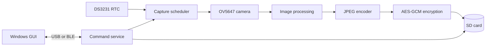
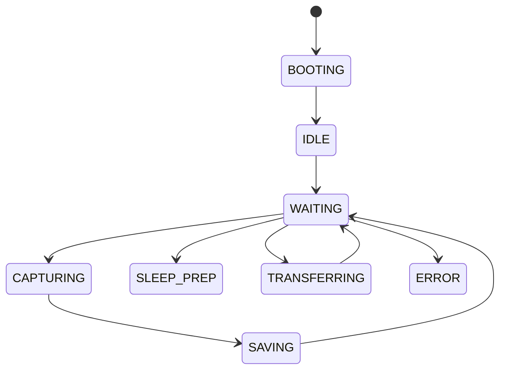

# Embedded Software Design of the Autonomous Camera

## 1. Introduction

This project is an autonomous camera built around an ESP32-P4. Its main job is to capture images, convert them to JPEG, encrypt them, and save them to an SD card. It can be controlled from a Windows application through USB serial or Bluetooth Low Energy (BLE). It can also run without a PC by using an external DS3231 real-time clock (RTC) to keep time across deep sleep and complete power loss.

The software is larger than a simple camera program because several things can happen at once. The camera may be capturing while the SD card is writing. The user may request a file while automatic capture is active. Power may fail while a file or setting is being saved. The device may also need to sleep for hours and then continue the same program after waking.

To manage this complexity, the code uses several design patterns described by Elecia White in *Making Embedded Systems: Design Patterns for Great Software*. A design pattern is a reusable way of organizing software. It is not copied code. It is a known structure for solving a common design problem.

This chapter explains the software in simple terms, identifies the patterns used, and shows where each pattern appears in the project.

## 2. What the System Contains

The system has the following main parts:

- an ESP32-P4 application processor;
- an OV5647 camera connected through MIPI CSI;
- the ESP32-P4 image signal processor and JPEG hardware;
- an SD card for media and summary files;
- a DS3231 RTC for battery-backed calendar time;
- USB serial for commands and development;
- an ESP32-C6 radio coprocessor for BLE; and
- a Windows GUI for control and media download.

The main data flow is:



Most project-owned firmware is in `main/`. The Windows software is in `../../App/`. The camera driver under `components/` and packages under `managed_components/` are supporting libraries.

## 3. Design Patterns Used

The following table gives a quick map from the book to this project.

| Pattern or principle from the book | Where it appears in this project | What it solves |
|---|---|---|
| Layering | Hardware modules, services, policy, commands, and GUI | Stops hardware details from spreading through the application |
| Encapsulated Modules | `rtc.c`, `sd_storage.c`, `image_crypto.c`, `media_transfer.c` | Gives each module one clear responsibility |
| Delegation of Tasks | Camera capture delegates saving to a writer task | Keeps slow SD writes out of the capture path |
| Adapter Pattern | Serial and BLE transports use a common command-facing interface | Lets the same command logic work over different links |
| Facade Pattern | Camera, storage, and transfer APIs hide multi-step hardware operations | Gives callers a small and safer API |
| Dependency Injection | Media transfer receives camera-control callbacks | Reduces direct dependencies and improves testability |
| Command Pattern | Text commands are mapped to handler functions | Organizes external control without a giant conditional block |
| Table-Driven State Machine | `program_state.c` | Allows only valid operating-state changes |
| Active Object | `app_controller.c` owns state and receives queued events | Prevents tasks from changing shared state directly |
| Pipeline and Filters | Capture, JPEG, encryption, storage, and transfer stages | Breaks a large data operation into understandable stages |
| Watchdog | ESP-IDF task watchdog plus `watchdog_supervisor.c` | Detects tasks that stop making progress |
| Versioned Communication | `protocol_version.c`, frame versions, capability flags | Allows firmware and GUI versions to evolve safely |
| Checksums, Hashes, and Authentication | CRC-16 frames, SHA-256 media hashes, AES-GCM tags | Detects damaged or modified data |
| Low-Power Event Flow | RTC wake-up, timer wake-up, and deep sleep | Reduces energy use during autonomous operation |

These names follow the terminology in White's chapters on architecture, hardware abstraction, commands, activity flow, data pipelines, connected devices, and power management.[^white-book]

## 4. Layering, Encapsulation, and Facades

White describes layering and encapsulated modules as ways to control dependencies (White 2024, 20-27). In simple terms, higher-level code should ask for a service instead of manipulating hardware registers or driver handles directly.

This project uses four broad layers:

1. **Hardware-facing modules** talk to the RTC, camera, JPEG hardware, and SD card.
2. **Service modules** provide encrypted storage, media transfer, health reporting, and daily summaries.
3. **Policy modules** decide when capture, communication, transfer, and sleep are allowed.
4. **Command and GUI modules** translate user requests into those operations.

For example, code that needs the current time calls `rtc_get_time()`. It does not build an I2C transaction itself. Code that saves a capture uses the storage and encryption services. It does not need to know every step of the FAT file transaction.

This is also an example of the **Facade Pattern** from the book (White 2024, 99). A facade gives the rest of the program a small interface to a complicated subsystem. `camera_capture_once()` acts as a facade for buffer handling, stream control, JPEG encoding, and ownership transfer. The media-transfer API acts as a facade for pausing the camera, reading or decrypting files, framing data, and resuming normal operation.

The benefit is easier maintenance. A driver or SDK API can change without forcing the same change through the whole program. The migration to ESP-IDF 6.0.2 demonstrates this. Legacy mbedTLS calls were replaced by PSA Crypto inside `crypto_kdf.c` and `image_crypto.c`. The camera and command code did not need to become PSA Crypto code.

## 5. Delegation and the Producer-Consumer Pipeline

Capturing an image and writing it to an SD card have very different timing. Camera buffers must be handled quickly, while encryption and SD writes may take much longer. If the capture task performed every operation itself, it could block the camera pipeline and lose frames.

The firmware therefore delegates saving to a separate writer task. The capture side is the **producer**. It creates a save job containing a copied JPEG buffer. The writer task is the **consumer**. It encrypts the buffer, writes the result, updates metrics, and frees the memory.

The queue between them is bounded. This matters because memory is limited. If the SD card becomes slow, the queue cannot grow forever. Instead, the full queue creates backpressure and makes the overload visible.

This design combines White's **Delegation of Tasks** principle with the **Pipelines and Filters** pattern (White 2024, 22, 233-235). The complete image pipeline is:

```text
Camera frame
    -> image signal processing
    -> JPEG encoding
    -> queued save job
    -> AES-GCM encryption
    -> atomic SD-card write
    -> media index update
```

Each stage has a clear input and output. This makes timing and memory ownership easier to understand. The writer owns a queued JPEG buffer and must free it whether saving succeeds or fails.

## 6. State Machines

The camera can be idle, waiting, capturing, saving, transferring, preparing to sleep, or handling an error. These states cannot change in any order. For example, the program should not jump directly from booting to saving when no image exists.

`program_state.c` uses a **Table-Driven State Machine**, a pattern described by White in Chapter 6 (White 2024, 156-163). The table lists which transitions are legal. An invalid transition returns an error instead of silently changing state.



White gives useful advice when selecting a state-machine form: “When you consider your implementation, be lazy.”[^white-state] Here, that means choosing the smallest clear solution. A transition table is enough for this project. A more complicated class hierarchy would add code without solving a new problem.

The explicit state machine has three advantages:

- reviewers can see every allowed transition in one place;
- invalid behavior is detected early; and
- transfer or error handling can remember the previous state and return to it safely.

## 7. Active Object and Event-Driven State Ownership

The firmware also has simple shared facts: whether capture is enabled, paused, ready, forced awake, or transferring. Several FreeRTOS tasks need to read these values, but allowing every task to write them directly would create race conditions.

`app_controller.c` uses the **Active Object** pattern described by White (White 2024, 174-176). One controller task owns the mutable state. Other tasks send typed events through a queue. The controller processes the events one at a time and publishes read-only snapshots.

```text
button, command, camera, or transfer task
                 -> event queue
                 -> controller task
                 -> updated state snapshot
```

This also follows the book's discussion of interrupts causing events. White notes that “The decoupling of the subsystems is good”[^white-events]. In this project, producers report that something happened; the owning task decides how shared state changes. Blocking hardware and file work stays outside interrupt context, and critical sections remain short.

## 8. Adapter, Interfaces, and Dependency Injection

The device accepts commands over USB serial and BLE. These transports move data differently, but commands such as status, time setting, capture, and media listing should behave the same way.

The transport layer therefore acts as an **Adapter** (White 2024, 25). It converts transport-specific input and output into the form expected by the command system. Command handlers reply through a callback and context rather than writing directly to a USB or BLE object.

The same idea appears in the GUI. `device_transport.py` contains serial and BLE transport classes. `command_service.py` uses either transport and returns one common result type to the interface.

The firmware also uses **Dependency Injection**, which White discusses as a way to increase flexibility (White 2024, 109-111). `media_transfer` does not directly control camera globals. During initialization, it receives callbacks for operations such as:

- pause capture;
- wait for the camera to become idle;
- suspend or resume the stream; and
- publish whether transfer is active.

The transfer service knows what operations it may request, but it does not own the camera implementation. This lowers coupling and makes the service easier to test or reuse.

## 9. Command Pattern and Versioned Protocols

The **Command Pattern** turns an external request into a handler that performs one action (White 2024, 79-81). The firmware has a command table containing command names, argument rules, and handler functions. The dispatcher finds the matching entry and invokes it.

This is clearer than one very large `if/else` chain. It also makes command groups easier to separate into media, diagnostic, summary, and general-control modules.

Communication is versioned because the firmware and GUI may not be updated at the same time. The device reports protocol versions and named capabilities. The GUI checks those capabilities before using newer features. Media frames also contain sequence and integrity information.

This follows the book's guidance on versioning and robust communication (White 2024, 268-270). The project uses:

- protocol and frame version numbers;
- named capability flags;
- CRC-16 for transfer frames;
- SHA-256 for complete-file verification; and
- retry and resume support for interrupted downloads.

A CRC detects accidental transfer damage. A cryptographic hash provides a stronger whole-file comparison. Neither one replaces encryption or authentication.

## 10. Persistent Storage and Power-Loss Recovery

The device must survive power being removed at any moment. Two types of information need protection: the active capture program and the media files.

### 10.1 Program settings

`program_persistence.c` stores a versioned record in ESP-IDF's NVS storage. The record includes a magic value, version, size, capture-enabled flag, schedule, interval, burst setting, and start day. NVS commit is the point at which the update becomes durable.

When power returns, the ESP32-P4 boots from the beginning. It does not continue from the exact instruction where power failed. The firmware loads the saved program from NVS and reads the battery-backed DS3231 RTC. It can then decide whether to resume capture now or wait for the next schedule window.

The RTC keeps calendar time; NVS remembers what the program was doing. Both are required for meaningful recovery.

### 10.2 Media files

Media and summary files use a small transaction:

1. write new content to a `.tmp` file;
2. flush and synchronize the data;
3. rename an existing final file to `.bak`, if necessary;
4. rename the temporary file to the final name; and
5. remove the backup after success.

At startup, the storage service examines leftover temporary and backup files. This cannot make FAT fully transactional, but it greatly reduces the chance that a good file is replaced by a partial one.

This is a project-specific transactional-storage technique. It supports the book's broader guidance on data storage and key-value stores, but it is not presented as one of the book's named patterns.

## 11. Encryption and Data Integrity

New captures are encrypted with AES-256-GCM before being stored on the removable card. A versioned header contains the salt, nonce, format information, and authentication data needed for decryption.

The encryption design provides:

- confidentiality, because the JPEG is not stored as readable plaintext;
- integrity, because the GCM authentication tag detects modification; and
- format evolution, because the encrypted header has a version.

Key derivation, hashing, random generation, encryption, and decryption use the PSA Crypto API required by ESP-IDF 6.0.2. Cryptographic details remain inside `crypto_kdf.c` and `image_crypto.c`.

Encryption at rest does not solve every security problem. It does not guarantee that the user's password is strong, authenticate every person using the GUI, or automatically encrypt the USB/BLE transport. Secure boot, flash encryption, provisioning, BLE pairing, and credential rotation remain separate controls.

## 12. Watchdogs and Diagnostics

A watchdog resets a system that stops making progress. This firmware uses ESP-IDF's task watchdog and a higher-level `watchdog_supervisor`.

The supervisor expects named tasks to report heartbeats before their deadlines. If a task becomes overdue, the supervisor records which task failed before the hardware-level watchdog resets the processor. This makes later diagnosis more useful.

White warns that “Using a watchdog does not free you from handling normal errors”[^white-watchdog]. The code therefore still checks return values, reports invalid states, retries selected operations, and records errors. The watchdog is the last recovery mechanism, not ordinary control flow.

The project keeps several kinds of diagnostic evidence:

- ESP-IDF logs for current activity;
- daily summaries for capture and timing statistics;
- NVS health records for boot count, reset cause, and the last subsystem error;
- RTC-memory breadcrumbs that can survive a reset;
- FreeRTOS runtime and task information; and
- ELF core dumps in a dedicated flash partition.

These layers answer different questions. Logs explain what is happening now. Breadcrumbs explain what happened shortly before a reset. NVS records survive complete power loss. A core dump supports detailed debugging when the processor crashes.

## 13. Scheduling and Low-Power Operation

The external RTC provides calendar time for capture schedules. The scheduler supports daytime windows and windows that cross midnight, such as 22:00 to 06:00. It can also stop after a configured number of days.

Before deep sleep, the firmware saves required state, completes or abandons storage work safely, configures wake sources, and disables services that are not needed. A timer wake used for autonomous capture normally avoids starting the radio. A connected USB host requests interactive behavior and keeps the device awake.

The firmware also adjusts for wake-up delay. If the requested image interval is 60 seconds, the processor must wake before the next image is due because camera startup takes time. The scheduler compares the observed interval with the target and applies a small bounded correction. Limiting the correction prevents one slow capture from causing a large timing error on the next cycle.

This follows White's low-power principles: turn off unused subsystems, put the processor to sleep, and avoid unnecessary wake-ups (White 2024, 361-370).

## 14. The Windows GUI

The packaged application is `BreadboardCameraGUI.exe`, built from `../../App/GUI.py` with PyInstaller. It uses Tkinter for the active interface.

The GUI is divided into layers:

- `device_transport.py` moves serial and BLE data;
- `command_service.py` sends commands and cleans replies;
- `device_queries.py` reads status and summaries;
- `device_actions.py` performs capture and clock-sync operations;
- `media_protocol.py` parses frames and validates CRC values;
- `media_transfer_service.py` plans and performs downloads; and
- `views.py` and `GUI.py` display information and handle user actions.

The packaged EXE includes its Python dependencies and logo. Runtime settings and the salted password record are stored beside the executable, not inside PyInstaller's temporary directory. Password changes use an atomic temporary-file replacement so a partial write does not normally destroy the previous credential record.

This GUI structure applies the same layering, adapter, command, and encapsulation ideas as the firmware. Widgets display results; they do not directly implement serial framing, cryptography, or media-transfer rules.

## 15. Boot Sequence

Startup order matters because later services depend on earlier ones. A simplified boot sequence is:

1. initialize persistent health and watchdog services;
2. load the saved autonomous program from NVS;
3. determine the reset and wake-up reason;
4. initialize the DS3231 RTC and establish valid time;
5. mount and recover the SD card;
6. create the application controller and command services;
7. initialize the camera, JPEG encoder, and writer task;
8. start USB and, when policy allows, BLE communication; and
9. continue the saved schedule or wait for a command.

Not every failure causes a boot loop. If the camera or SD card fails, command and diagnostic paths can remain available. This lets the user ask the device what went wrong.

## 16. Verification

The current verified baseline is ESP-IDF 6.0.2 targeting ESP32-P4. The complete firmware builds successfully in the normal `build/` directory. Python sources are checked with `compileall`, and the packaged GUI is smoke-tested by launching it and confirming that it remains running.

The architecture makes future host tests practical. `capture_scheduler.c`, `program_state.c`, and `protocol_frame.c` mostly contain deterministic logic that can be tested without camera hardware. GUI protocol parsing, settings validation, transfer planning, and presentation formatting can also be tested without opening a window.

Hardware tests are still necessary. A PC cannot accurately reproduce MIPI timing, DMA conflicts, SD-card removal, RTC oscillator faults, deep-sleep wiring, brownouts, or radio coexistence. Important system tests include:

- cutting power during program and media updates;
- running capture and sleep cycles for many hours;
- checking schedule boundaries across midnight;
- removing the SD card during each write stage;
- interrupting and resuming large downloads;
- using a wrong password or modified encrypted file;
- forcing watchdog failures; and
- monitoring heap usage and capture timing over long runs.

## 17. Design Strengths and Remaining Work

The main strength of the design is clear ownership:

- the controller owns shared application flags;
- the state machine owns legal lifecycle changes;
- the camera task owns capture hardware;
- the writer owns queued JPEG memory;
- the storage service owns file transactions;
- crypto modules own encryption details; and
- transport modules own serial and BLE mechanics.

This makes failures easier to locate and reduces accidental coupling.

Some work remains. `main.c` is still a large integration point. The project would benefit from restoring automated host tests, especially for schedules, state transitions, framing, and interrupted storage operations. Production deployment would also require a complete secure-boot, flash-encryption, provisioning, and credential-rotation plan.

## 18. Conclusion

This autonomous camera uses design patterns because the hardware creates real coordination problems. Slow storage must not block capture. Several tasks must not change shared state at the same time. USB and BLE should not require duplicate command logic. Power loss must not erase the active program or leave corrupt files. Failures must leave enough evidence to diagnose them.

The most important patterns taken from *Making Embedded Systems* are:

- Layering and Encapsulated Modules;
- Delegation of Tasks;
- Adapter and Facade;
- Dependency Injection;
- Command;
- Table-Driven State Machine;
- Active Object and event-driven flow;
- Pipelines and Filters;
- Watchdog recovery; and
- versioned, integrity-checked communication.

Each pattern answers a practical question: who owns this state, which layer knows this hardware detail, what happens when work is slow, and how does the system recover when something fails?

## Appendix A: Main Firmware Source Files

- `app_controller.c` owns shared application flags and updates them by processing queued events from other tasks.
- `camera_capture.c` controls the MIPI CSI and ISP capture pipeline and sends completed JPEG images to the asynchronous storage worker.
- `capture_scheduler.c` calculates active schedule windows, day limits, sleep durations, and bounded wake-time corrections.
- `command_dispatcher.c` finds textual commands in a handler table and calls the matching transport-independent function.
- `command_transport.c` sends command replies through standard output, UART, BLE, or a media-transfer callback.
- `communications_control.c` detects USB availability and controls the reset and power-related signals for the ESP32-C6 radio processor.
- `communications_policy.c` decides whether command and radio services should start for the current wake-up reason.
- `crypto_kdf.c` derives encryption keys with PBKDF2-HMAC-SHA256 through the ESP-IDF 6 PSA Crypto API.
- `daily_summary.c` collects capture and storage measurements and writes one atomic report for each operating day.
- `device_credentials.c` creates and stores the per-device credentials used to protect media and authenticated logs.
- `device_settings.c` provides one read-only runtime view of the project's important compile-time settings.
- `diagnostic_commands.c` implements read-only commands for examining tasks, memory, recorded faults, and recent events.
- `event_breadcrumbs.c` keeps a small event history in RTC memory so important events can be inspected after a reset.
- `health_diag.c` stores persistent boot, reset, error, and subsystem-failure information in NVS.
- `image_crypto.c` encrypts and decrypts image data with AES-GCM and a versioned on-disk file header.
- `jpeg_m2m_encoder.c` wraps the ESP32-P4 V4L2 memory-to-memory hardware JPEG encoder behind a simpler API.
- `log_sink.c` creates and recovers an append-only log whose records are protected against undetected modification.
- `main.c` connects all firmware modules and manages boot, tasks, commands, scheduling, communication, and sleep.
- `media_commands.c` converts the textual `IMG_*` commands into calls to the transport-independent media service.
- `media_transfer.c` safely pauses capture and provides resumable, integrity-checked transfer and deletion of SD-card media.
- `program_persistence.c` saves and restores a versioned NVS record so an autonomous program can continue after power loss.
- `program_state.c` implements the table-driven program state machine and rejects invalid state changes.
- `protocol_frame.c` provides CRC and wire-format helpers for integrity-checked media frames.
- `protocol_version.c` selects the highest application protocol version supported by both the device and the client.
- `rtc.c` controls DS3231 time, alarms, oscillator status, square-wave output, and temperature readings over I2C.
- `sd_storage.c` mounts and serializes access to the SD card and provides atomic-write and startup-recovery operations.
- `startup_init.c` initializes NVS during boot and restores the saved camera operating mode.
- `summary_commands.c` validates summary filenames and exposes daily summary listing, reading, and deletion through commands.
- `watchdog_supervisor.c` monitors task heartbeats, records overdue tasks, and coordinates feeding the ESP-IDF watchdog.

## References

[^white-book]: Elecia White, *Making Embedded Systems: Design Patterns for Great Software*, 2nd ed. (O'Reilly Media, 2024), chapters 2-3, 6, 8, 10, and 13.

[^white-state]: White, *Making Embedded Systems*, 164.

[^white-events]: White, *Making Embedded Systems*, 170.

[^white-watchdog]: White, *Making Embedded Systems*, 165.

White, Elecia. *Making Embedded Systems: Design Patterns for Great Software*. 2nd ed. Sebastopol, CA: O'Reilly Media, 2024. ISBN 978-1-098-15154-6.
