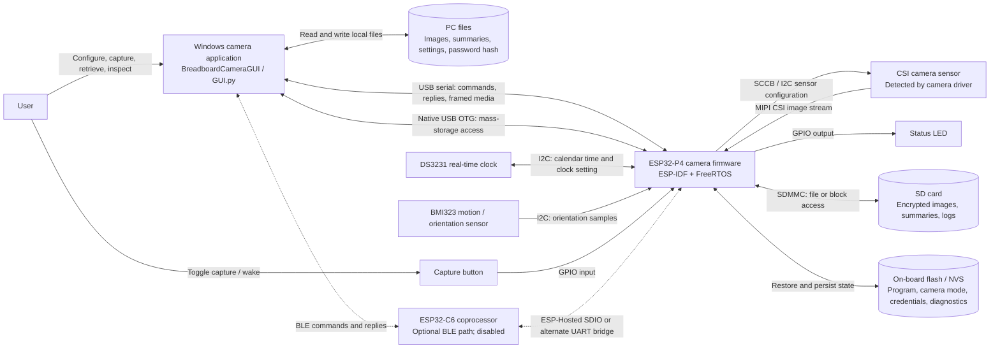
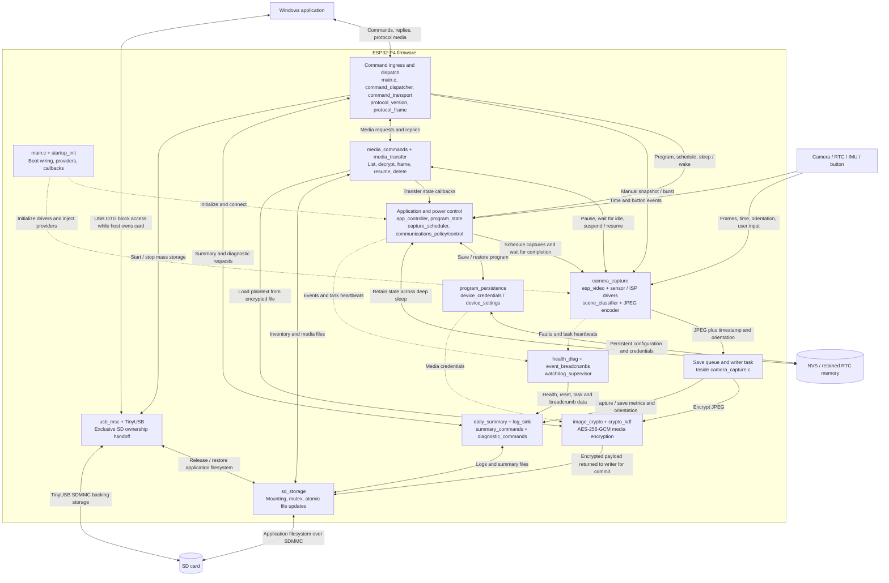
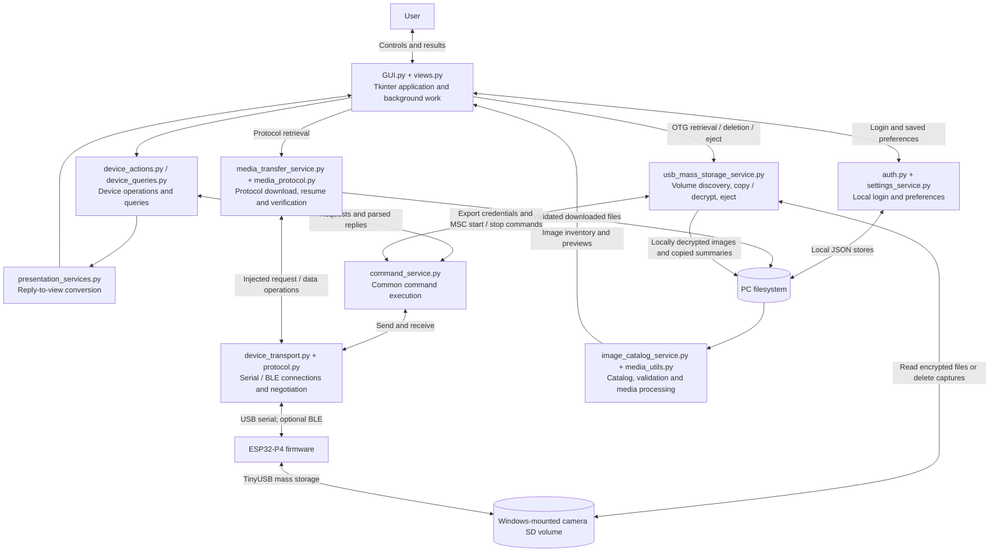

# Project context and component interactions

**[Open the interactive architecture explorer](project-architecture.html)** for three visual views with zoom, component descriptions, source links, and SVG export. The page works offline in a web browser.

This document describes the source and configuration in this workspace. The system is an autonomous ESP32-P4 camera with a Windows Tkinter application. It can capture without the PC and reconnect for configuration, diagnostics, and media retrieval. Arrows describe commands or data exchanged, rather than every function call. Dashed arrows indicate optional paths or supporting interactions.

## System context

The two USB connections serve different purposes. USB serial carries the command protocol and can download media. Native OTG exposes the SD card as a Windows volume after an explicit command over the control connection. The firmware and Windows take turns owning the card.

The source supports sensor detection rather than proving which camera is physically attached. `sdkconfig` enables OV5647 and SC2336 support; `camera_capture.c` also names Arducam IMX500 in its detection message. The startup camera-mode code specifically calls the SC2336 driver. Treat the camera node as the attached, detected sensor rather than assuming the older documentation's OV5647-only description.

## Firmware interactions

`main.c` remains the composition root: it supplies concrete command handlers, starts tasks, connects callbacks, provides timestamps and orientation, and manages deep sleep. `app_controller` owns shared control state through queued events; `program_state` tracks lifecycle transitions; `capture_scheduler` evaluates capture windows. These are complementary parts, not three independent schedulers.

The capture pipeline produces JPEGs and queues save jobs. Its writer task encrypts and commits files through `sd_storage`, then records indexing and summary information. The current setting selects the direct hardware JPEG encoder (`CAMERA_JPEG_BACKEND_M2M = 0`); `jpeg_m2m_encoder` is an alternate implementation.

## Windows application interactions

`GUI.pyw` launches `GUI.py`, and `Build_GUI_App.cmd` packages that same application as `../../App/BreadboardCameraGUI.exe`. Executables in other folders are build/distribution artifacts; this diagram does not assert that every existing binary matches today's source.

## Main end-to-end flows

1. **Autonomous capture:** boot restores the program from retained memory or NVS; the scheduler checks time; capture reads a frame and orientation; JPEG encoding feeds the save queue; the writer encrypts and saves to SD. Firmware waits for idle before scheduled deep sleep. Timer and button wake paths restart the application.
2. **Control:** a GUI action passes through the command service and transport to firmware dispatch. Handlers update the controller, persistent configuration, clock, or camera and return replies over the initiating transport.
3. **Serial media retrieval:** the GUI requests inventory and files; firmware coordinates capture/transfer state, loads and decrypts media, and sends framed payloads. The GUI checks frame integrity and file metadata/hash information before committing downloads.
4. **OTG media retrieval:** the GUI requests media export credentials and `USB_MSC_START`; firmware pauses capture, waits for idle, suspends the stream, closes the log, and lends the SD card to Windows. The GUI decrypts image files locally. Eject/dismount and `USB_MSC_STOP` return filesystem ownership and restore capture state.
5. **Diagnostics:** tasks report faults, breadcrumbs, heartbeats, and capture/save metrics. Diagnostic and summary commands expose the resulting information to the GUI; the watchdog supervisor detects stalled registered tasks.

## Current configuration and boundaries

- Both `CAMERA_ESP_HOSTED_BLE_ENABLE` and `CAMERA_C6_BLE_BRIDGE_ENABLE` are `0`. BLE support exists in source but is not an active control path under these settings.
- The wired command task starts on every wake. Radio startup is separately subject to the communications power policy.
- The camera control bus shares I2C with the DS3231; the BMI323 uses a separate I2C port. DS3231 calendar time and the ESP32's retained RTC memory are distinct facilities.
- `CAMERA_USB_DETECT_GPIO` is unconfigured. A dedicated USB-detect GPIO wake is therefore conditional; native OTG connection detection and USB-serial connection checks are separate mechanisms.
- `components/` contains local Espressif camera/video components. `managed_components/` supplies dependencies such as TinyUSB and ESP-Hosted. Dependency presence alone does not make Wi-Fi or a cloud service part of the application; no such application path is shown here.
- GUI password authentication is local to the desktop application. It is separate from firmware media credentials and image encryption.

## Source map

| Relationship | Main source evidence |
|---|---|
| Boot, tasks, command registration, sleep and callbacks | [main.c](../main/main.c), [startup_init.c](../main/startup_init.c) |
| Application state and schedule decisions | [app_controller.c](../main/app_controller.c), [program_state.c](../main/program_state.c), [capture_scheduler.c](../main/capture_scheduler.c) |
| Camera, JPEG, save queue, encryption and metadata | [camera_capture.c](../main/camera_capture.c), [image_crypto.c](../main/image_crypto.c), [daily_summary.c](../main/daily_summary.c) |
| Command framing and protocol downloads | [command_transport.c](../main/command_transport.c), [media_transfer.c](../main/media_transfer.c), [protocol_frame.c](../main/protocol_frame.c) |
| Exclusive SD ownership and OTG transfer | [sd_storage.h](../main/sd_storage.h), [usb_msc.c](../main/usb_msc.c), [usb_mass_storage_service.py](../../../App/usb_mass_storage_service.py) |
| Hardware configuration and optional interfaces | [device_settings.h](../main/device_settings.h), [sdkconfig](../sdkconfig), [communications_policy.c](../main/communications_policy.c) |
| Desktop entry point, services and transports | [GUI.py](../../../App/GUI.py), [command_service.py](../../../App/command_service.py), [device_transport.py](../../../App/device_transport.py), [media_transfer_service.py](../../../App/media_transfer_service.py) |
| Build composition and dependencies | [main/CMakeLists.txt](../main/CMakeLists.txt), [idf_component.yml](../main/idf_component.yml), [Build_GUI_App.cmd](../../../App/Build_GUI_App.cmd) |

This is a source-based architecture review, not a hardware connectivity test. Open this Markdown file in a Mermaid-capable preview to render the diagrams.
