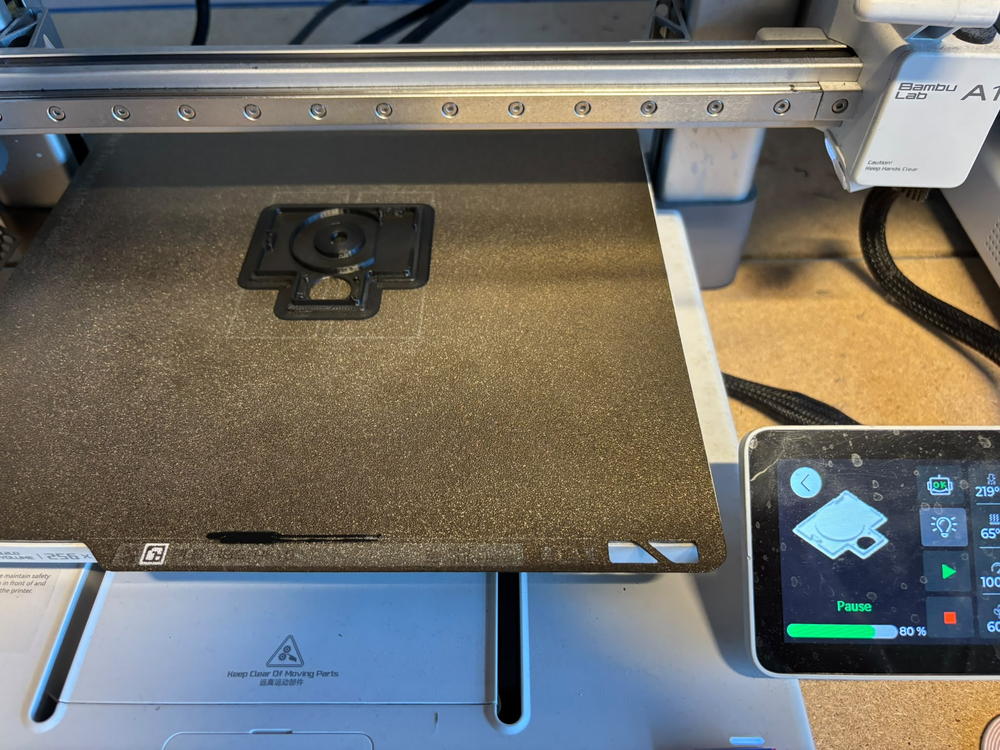
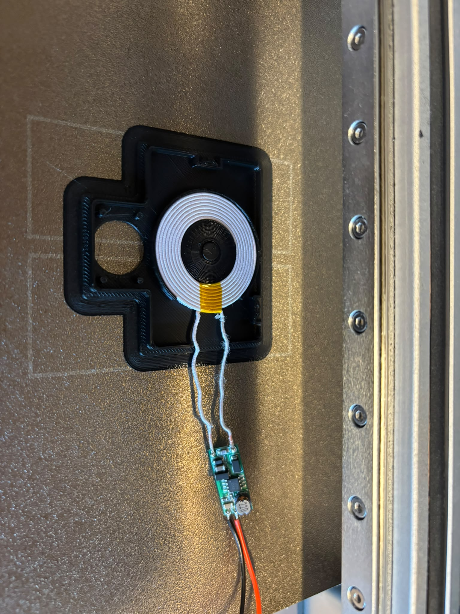
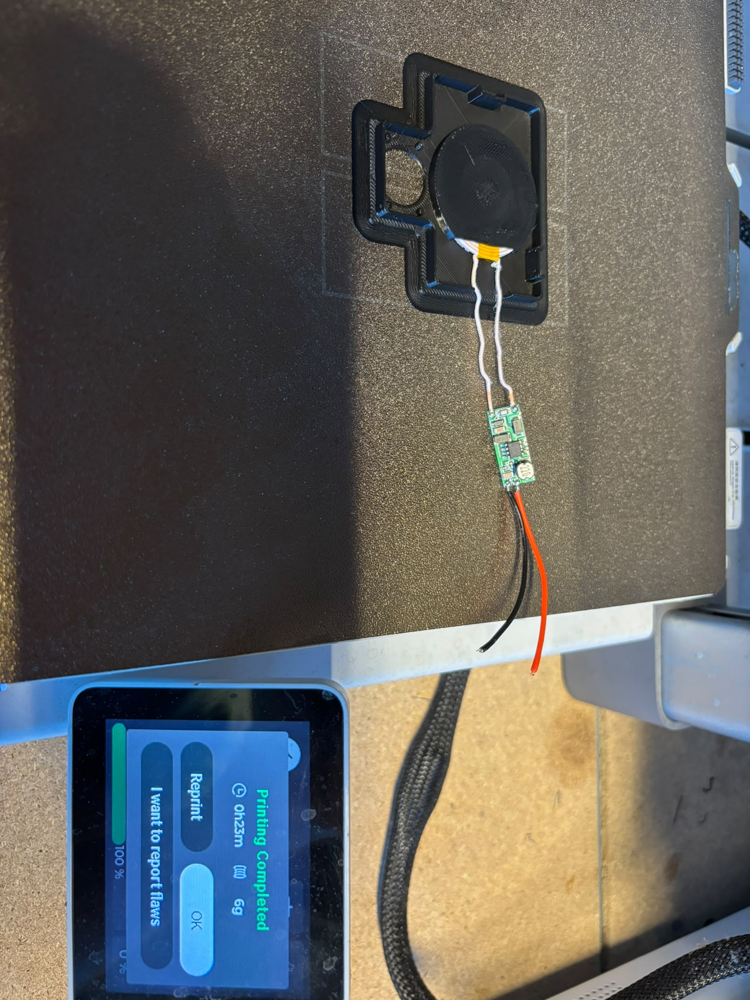

This folder contains the STL gcode files needed to make the PCB Case.

To insert the magnet and receiver coil into teh Lid of teh PCB Case, the print has to be paused at 79-80% percent, pay attention close attention when the 3D printer.

The magnet should be able to fit into the central hole and the wireless coil needs to be gently press fitted into the print.

Once that is done, resume the printing process.

